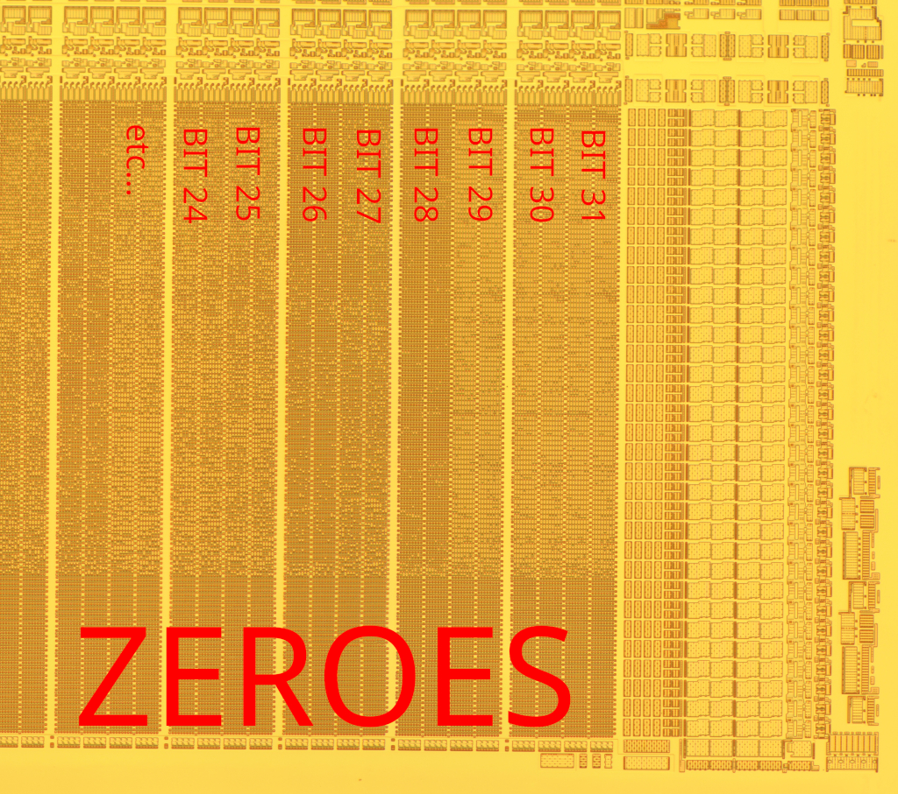

Howdy!

The Mykotronx MYK82 is the basis of the [Fortezza PCMCIA
Card](https://www.cryptomuseum.com/crypto/usa/fortezza/) from Spyrus.
It holds both an ARM6L CPU and a hardware implementation of the
Skipjack algorithm.  It was the immediate successor to the MYK78
[Clipper Chip](https://en.wikipedia.org/wiki/Clipper_chip).

This repository contains my firmware extraction of that chip, largely
performed through mask ROM photography.

`rom20x6.tif` and `rom20x7.tif` are accurately marked main mask ROMs
from the MYK82.  The matching `.json` files contain the bit markings
for [MaskRomTool](https://github.com/travisgoodspeed/maskromtool/).

To dump the ROM into bytes, first install MaskRomTool and then run
`make clean all`.  This will extract the firmware from both images,
diff them, and then convert from little to big endian.  The final
result is `rom.bin`.

`eeprom.img` is an image of the 128kB EEPROM, part number SST29EE010.
It is big endian, as we can see by the strings and the PCMCIA CID
structure.

`lutleft.bmp` and `lutright.bmp` are identical lookup tables.  They
contain the F-Tables from page 8 of the [Skipjack
Algorithm](https://csrc.nist.gov/CSRC/media//Projects/Cryptographic-Algorithm-Validation-Program/documents/skipjack/skipjack.pdf),
which was declassified in 1998.  This same look up table is also found
in the MYK78 Clipper Chip.

Kind thanks to Matt Blaze, Sandy Clark, and Perry Metzger for getting
me hooked on this chip, and thanks to John McMaster and EVM for
inspiring me to finish it.

--Travis Goodspeed

## Procedure

The ROM and LUTs were photographed by first decapsulating the chip
with red fuming nitric acid and then delayering the chip with dilute
hydrofluoric acid.  No Dash Etch or other bit staining was required,
as the bits are freely visible in the correct layer.

This photo shows a partially delayered ROM, with bits visible in some
regions and access lines in others.

After photography, I used my
[MaskRomTool](https://github.com/travisgoodspeed/maskromtool/)
application to mark the physical bits and convert them to logical
bytes.

The EEPROM was read by soldering the SST29EE010 chip to a carrier
board, then reading it with an XGecu TL866II Plus device.

## Bit Ordering

The main ROM begins with 32-bit ARM code and ends with zeroes.

Bits are organized into sixteen major columns, each of which contains
four minor columns.  Every half of a major column, consisting of two
minor columns, is a bit of significance.

So with the zeroes at the bottom of the photograph, bits 30 and 31 are
in the rightmost major column.  Bits 28 and 29 are in the second major
column from the right.

Each row contains sixteen 32-bit words.  To sample a 32-bit word, you
just take a single bit from each bit position (half a major column).
The first word within a row has all of its bits in the right-most
position of each set, and the last word within a row has all of its
bits in the left-most position of each set.

You can check that you got the right decoding order by ensuring that
the target of each function call looks like the valid entry point of a
call.  In this generation of ARM, the interrupt handlers are
instructions rather than addresses.

Because this memory is only read as 32-bit words, without support for
unaligned accesses or byte fetches, it isn't really big or little
endian.  I initially decoded it to little endian in keeping with
modern standards, but as the EEPROM is big endian, I now think that's
a more consistent representation.

## Related Docs

[Protocol Failure in the Escrowed Encryption
Standard](https://www.mattblaze.org/papers/eesproto.pdf) and [Key
Escrow from a Safe
Distance](https://www.mattblaze.org/escrow-acsac11.pdf) by Matt Blaze

